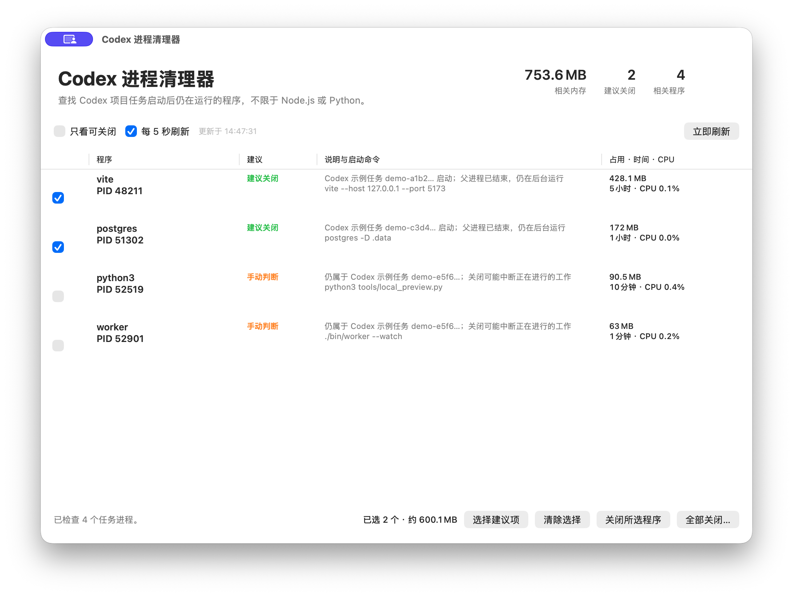

# Codex 进程清理器

<p align="center">
  
</p>

[English](README.md) | [简体中文](README.zh-CN.md)

一个原生 macOS 小工具，用来查看并关闭由 Codex 项目任务启动、但在任务结束后仍留在后台的程序。它不限定程序名称，也不会把普通项目进程当成 Codex 进程。



## 功能

- 根据进程继承的 `CODEX_THREAD_ID` 判断来源，并继续追踪它启动的子进程。
- 支持识别父进程已经结束、由 macOS 接管的后台程序，包括 Vite、esbuild、本地数据库和自定义可执行文件。
- 显示 PID、内存、CPU、运行时间、启动命令和安全状态。
- 父进程已经结束、运行超过 1 小时且 CPU 较低的程序会标为“建议关闭”。
- 支持关闭所选程序，也支持经过确认后关闭全部可关闭程序。
- Codex 主程序、当前界面和进程清理器本身始终受到保护。
- 只发送正常退出信号 `SIGTERM`，不删除文件，也不需要管理员权限。
- 使用原生 AppKit，不依赖第三方运行环境或软件包。
- Codex 正在运行但读不到任务标记时，会提示无法可靠检查，不会把结果写成“没有任务进程”。没有标记且父进程已结束的程序，无法可靠判断属于哪个任务。
- 界面支持英文和简体中文，并跟随 macOS 的语言设置。

## 系统要求

- macOS 14 或更高版本
- 从源码编译时需要 Xcode Command Line Tools

发布脚本会生成同时支持 Apple Silicon 和 Intel Mac 的通用程序。

## 编译

```bash
git clone https://github.com/tortorse/codex-process-cleaner.git
cd codex-process-cleaner
./scripts/build-release.sh
```

生成文件：

- `build/CodexProcessCleaner.app`
- `dist/CodexProcessCleaner-macOS-universal.zip`

如果只需编译适用于当前 Mac 的版本，可以运行：

```bash
./scripts/build-app.sh
```

## 打开未公证版本

本地和 GitHub Actions 编译的版本使用临时签名。由于程序尚未经过苹果公证，macOS 第一次启动时可能拒绝直接双击打开。请右键点击 App，选择“打开”，然后再次确认“打开”。

如果希望用户直接双击，并且不出现这项警告，需要使用 Apple Developer ID 证书签名，再提交苹果公证。

## “全部关闭”的范围

“全部关闭…”会同时处理“建议关闭”和“手动判断”项目，因此正在运行的 Codex 任务可能中断。执行前会显示程序数量和涉及的内存，受保护程序始终不会被关闭。

Codex 仍然需要的辅助程序可能会自动重新启动。关闭完成后，进程清理器会刷新列表，显示实际剩余项目。

## 隐私

所有检查都在本机通过 macOS `ps` 完成。程序只从进程环境中提取 Codex 任务编号，不显示或保存其他环境变量。程序没有网络代码，也不会上传进程信息。

## 许可证

[MIT](LICENSE)
